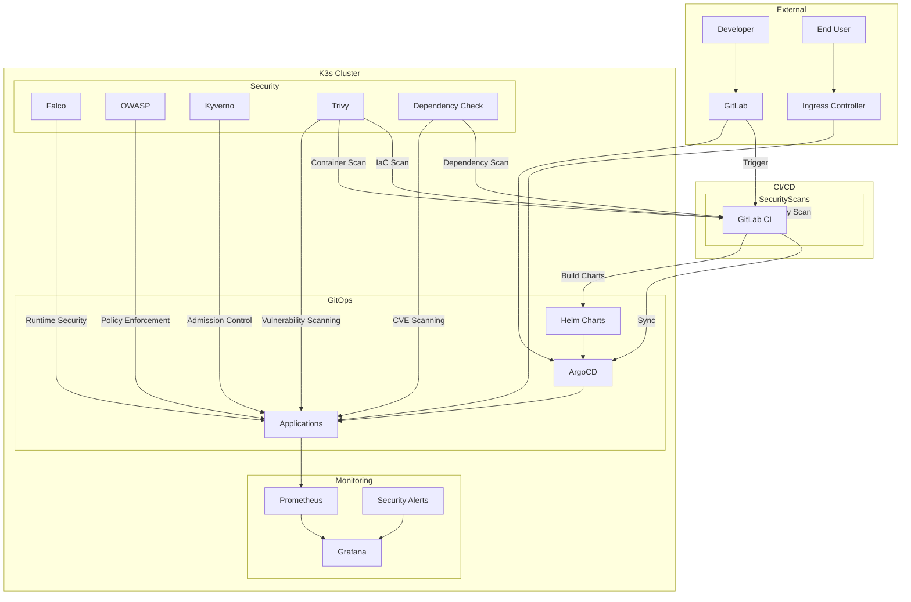
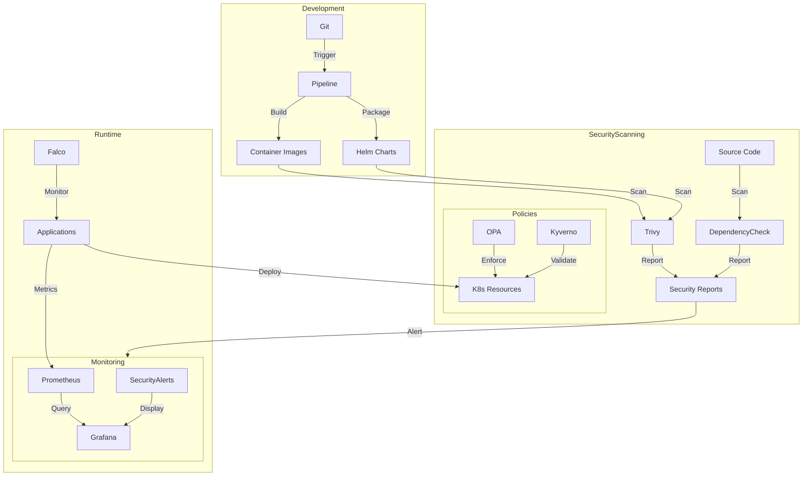
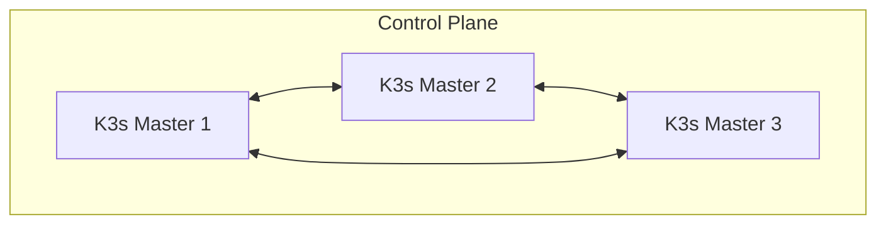

# Enterprise Kubernetes Infrastructure Project

## 🛠️ Tools & Technologies

### Core Infrastructure


### CI/CD & GitOps


### Security Tools


### Monitoring & Logging


## 🏗️ Architecture

### System Architecture


### Data Flow


### High Availability


## 📂 Project Structure

```plaintext
/devops-on-prem/
├── infrastructure/           # Core infrastructure configuration
│   ├── k3s/                # K3s cluster setup
│   │   └── config.yaml     # K3s configuration
│   ├── argocd/             # ArgoCD configuration
│   │   └── values.yaml     # ArgoCD Helm values
│   ├── ingress/            # Ingress controller setup
│   └── security/           # Security tools configuration
│       ├── falco/          # Falco runtime security
│       │   └── rules/      # Custom Falco rules
│       ├── kyverno/        # Policy management
│       │   ├── policies/   # Default policies
│       │   │   ├── require-probes.yaml
│       │   │   ├── require-resources.yaml
│       │   │   ├── require-labels.yaml
│       │   │   ├── require-non-root.yaml
│       │   │   ├── disallow-privileged.yaml
│       │   │   ├── disallow-latest-tag.yaml
│       │   │   └── restrict-registries.yaml
│       │   └── custom-policies/  # Environment-specific policies
│       └── opa/            # Open Policy Agent/Gatekeeper
│           └── constraints/  # OPA constraints
├── monitoring/             # Monitoring stack
│   ├── prometheus/        # Prometheus configuration
│   │   ├── rules/        # Alert rules
│   │   └── values.yaml   # Prometheus values
│   └── grafana/          # Grafana dashboards
│       ├── dashboards/   # Custom dashboards
│       └── values.yaml   # Grafana values
├── helm/                  # Helm charts
│   ├── charts/           # Application Helm charts
│   └── values/           # Environment-specific values
│       ├── development.yaml
│       ├── production.yaml
│       └── monitoring.yaml
├── terraform/             # IaC configurations
│   ├── cluster/          # K3s cluster resources
│   │   └── variables.tf  # Cluster variables
│   └── monitoring/       # Monitoring resources
│       └── variables.tf  # Monitoring variables
├── scripts/              # Utility scripts
│   ├── update-configs.sh # Configuration management
│   ├── setup-kyverno.sh # Kyverno setup
│   ├── trivy-scan.sh    # Security scanning
│   └── dependency-check.sh # Dependency scanning
├── templates/            # Configuration templates
│   ├── terraform.tfvars.template
│   ├── k3s-config.yaml.template
│   └── argocd-values.yaml.template
├── reports/              # Scan reports (gitignored)
│   ├── trivy/           # Trivy scan results
│   └── dependency-check/ # Dependency check results
├── values.yaml          # Example configuration values
├── values.local.yaml    # Local configuration (gitignored)
├── PARAMETERS.md        # Parameter documentation
└── README.md           # Project documentation
```

## 🚀 Quick Start

### Prerequisites
- Linux/Unix environment
- kubectl >={KUBECTL_MIN_VERSION}
- Terraform >={TERRAFORM_MIN_VERSION}
- yq (for YAML processing)

### 1. Configuration Setup
```bash
# Copy example values file
cp values.yaml values.local.yaml

# Edit your values
vim values.local.yaml

# Update all configuration files
./scripts/update-configs.sh
```

### 2. Infrastructure Setup
```bash
# Initialize Terraform with updated configuration
cd terraform
terraform init
terraform apply

# Install K3s with generated config
cd ../infrastructure/k3s
./setup.sh
```

### 3. Core Services Deployment
```bash
# Deploy services using generated configurations
cd ../argocd
./setup.sh

cd ../../monitoring
./setup.sh
```

### 4. Application Platform
```bash
# Deploy Sample Application
kubectl apply -f applicationset.yaml  # Replace with your application configuration
```

## 📝 Configuration Management

### Central Configuration
All configuration values are managed in a single `values.yaml` file:
```yaml
infrastructure:
  k3s: {...}
  gitlab: {...}
  argocd: {...}
monitoring:
  prometheus: {...}
  grafana: {...}
security:
  falco: {...}
  opa: {...}
  trivy: {...}
  dependency-check: {...}
```

### Update Process
1. Never modify `values.yaml` directly
2. Create/update `values.local.yaml` with your values
3. Run `./scripts/update-configs.sh`
4. Commit template files, not actual values

### Template Structure
```plaintext
/devops-on-prem/
├── values.yaml          # Example values (committed)
├── values.local.yaml    # Your actual values (gitignored)
├── templates/          # Configuration templates
│   ├── terraform.tfvars.template
│   ├── k3s-config.yaml.template
│   └── argocd-values.yaml.template
└── scripts/
    └── update-configs.sh  # Configuration update script
```

## 🔒 Security Features

1. **Authentication & Authorization**
   - RBAC policies
   - Service accounts

2. **Secret Management**
   - Automated rotation
   - Audit logging

3. **Container Security**
   - SecurityContext
   - Network policies

4. **Dependency Security**
   - OWASP Dependency-Check scanning
   - CVE vulnerability detection
   - Configurable CVSS thresholds
   - Custom suppressions support

5. **Infrastructure Security Scanning**
   - Trivy container scanning
   - Kubernetes resource scanning
   - Configuration file scanning
   - File system vulnerability scanning

### Running Security Scans
```bash
# Run dependency vulnerability scan
./scripts/dependency-check.sh

# Run Trivy security scans
./scripts/trivy-scan.sh

# View all security reports
ls -l reports/trivy/
```

### Security Scan Targets
- Container Images
- Kubernetes Resources
- Infrastructure as Code
- Configuration Files
- File System Vulnerabilities

### Security Reports
Reports are generated in multiple formats:
- Table (CLI output)
- JSON (for automation)
- HTML (for human review)

## 📊 Monitoring & Logging

1. **Metrics**
   - Node metrics
   - Container metrics
   - Custom application metrics

2. **Logging**
   - Centralized logging
   - Log retention policies
   - Structured logging

3. **Alerting**
   - PrometheusRules
   - Alert routing
   - Notification channels

## 🔄 Backup & Recovery

1. **Component Backups**
   - etcd backups

2. **Disaster Recovery**
   - Terraform state recovery
   - Full cluster recovery

## 🔧 Maintenance

### Regular Tasks
1. Certificate rotation
2. Backup verification
3. Security scanning

### Monitoring
1. Resource utilization
2. Security events
3. Application health
4. Backup status

## 🚨 Troubleshooting

### Common Issues
1. Certificate expiration
2. Storage pressure
3. Network connectivity
4. Authentication failures

### Debug Commands
```bash
# Check cluster health
kubectl get nodes
kubectl get pods -A

# View logs
kubectl logs -n <namespace> <pod-name>

# Check certificates
kubectl get certificates -A
```

## 🤝 Contributing

1. Fork the repository
2. Create feature branch
3. Commit changes
4. Create merge request


## 🔧 Parameters to Replace

The following parameters need to be replaced with actual values:

### Infrastructure Parameters
- `{GITLAB_INSTANCE_URL}`: Your GitLab instance URL (e.g., gitlab.company.com)
- `{NODE_IP}`: K3s node IP address
- `{K3S_TOKEN}`: K3s cluster token
- `{KUBECTL_MIN_VERSION}`: Minimum required kubectl version
- `{TERRAFORM_MIN_VERSION}`: Minimum required Terraform version

### Application Parameters
- `{ARGOCD_ADMIN_PASSWORD}`: Initial ArgoCD admin password
- `{ARGOCD_DOMAIN}`: ArgoCD ingress domain

### Configuration Files
The following files may need environment-specific values:
- `terraform/environment.tfvars`
- `helm/values/*.yaml`
- `infrastructure/*/config.yaml`
