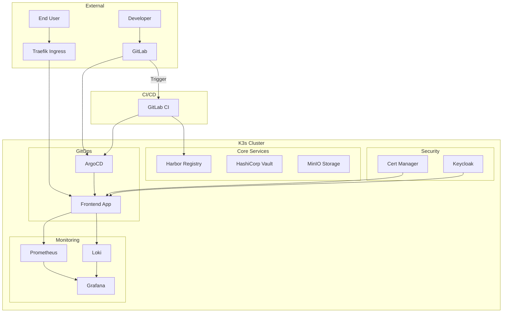
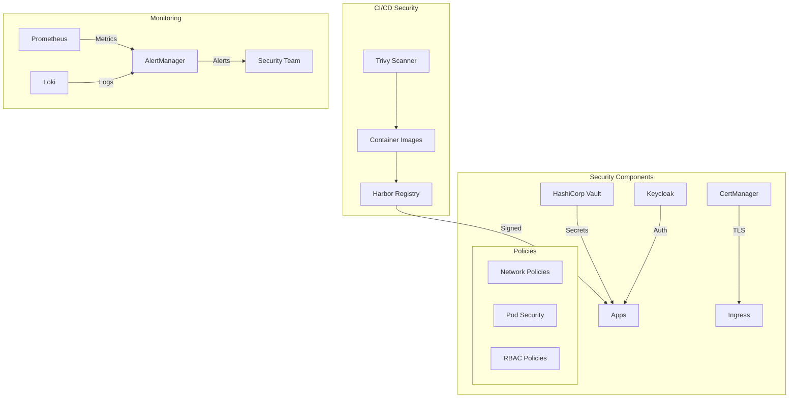
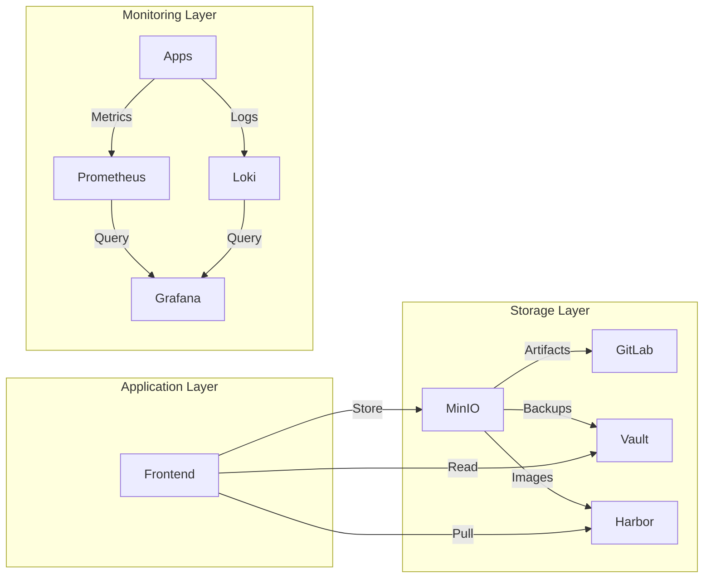
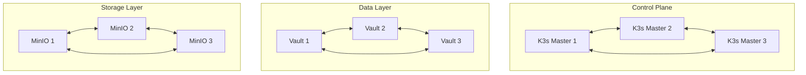

# Enterprise Kubernetes Infrastructure Project

## 🛠️ Tools & Technologies

### Core Infrastructure


### CI/CD & GitOps


### Security & Secrets


### Monitoring & Logging


### Storage & Registry


## 🏗️ Architecture

### System Architecture


### Security Flow


### Data Flow


### High Availability


## 📂 Project Structure

```plaintext
/devops/
├── infrastructure/        # Core infrastructure configuration
│   ├── auth/            # Keycloak & RBAC
│   ├── cert-manager/    # Certificate management
│   ├── registry/        # Harbor registry
│   ├── storage/        # MinIO configuration
│   └── vault/          # HashiCorp Vault
├── monitoring/          # Monitoring stack
│   ├── prometheus/     # Prometheus configuration
│   ├── grafana/       # Grafana dashboards
│   └── loki/          # Log aggregation
├── backup/             # Backup configurations
├── k3s/               # K3s cluster setup
├── helm/              # Helm charts
└── terraform/         # IaC configurations
```

## 🚀 Quick Start

### Prerequisites
- Linux/Unix environment
- Docker 20.10+
- kubectl 1.21+
- Helm 3.8+
- Terraform 1.0+

### 1. Infrastructure Setup
```bash
# Clone repository
git clone https://gitlab.local/devops-infrastructure.git
cd devops

# Initialize Terraform
cd terraform
terraform init
terraform apply

# Install K3s with CRI-O
cd ../k3s
./setup.sh
```

### 2. Core Services Deployment
```bash
# Deploy Vault
cd ../infrastructure/vault
./setup.sh

# Deploy Harbor Registry
cd ../registry
./setup.sh

# Deploy Monitoring Stack
cd ../../monitoring
./setup.sh
```

### 3. Application Platform
```bash
# Configure ArgoCD
cd ../argocd
./setup.sh

# Deploy Sample Application
kubectl apply -f applicationset.yaml
```

## 🔒 Security Features

1. **Authentication & Authorization**
   - Keycloak integration
   - RBAC policies
   - Service accounts

2. **Secret Management**
   - Vault for secrets
   - Automated rotation
   - Audit logging

3. **Container Security**
   - Trivy scanning
   - SecurityContext
   - Network policies

## 📊 Monitoring & Logging

1. **Metrics**
   - Node metrics
   - Container metrics
   - Custom application metrics

2. **Logging**
   - Centralized logging with Loki
   - Log retention policies
   - Structured logging

3. **Alerting**
   - PrometheusRules
   - Alert routing
   - Notification channels

## 🔄 Backup & Recovery

1. **Component Backups**
   - Vault snapshots
   - etcd backups
   - MinIO backups

2. **Disaster Recovery**
   - Terraform state recovery
   - Full cluster recovery
   - Component restoration

## 📚 Documentation

- [Architecture Guide](docs/architecture.md)
- [Security Guide](docs/security.md)
- [Operations Guide](docs/operations.md)
- [Disaster Recovery](docs/disaster-recovery.md)

## 🔧 Maintenance

### Regular Tasks
1. Certificate rotation
2. Secret rotation
3. Backup verification
4. Security scanning

### Monitoring
1. Resource utilization
2. Security events
3. Application health
4. Backup status

## 🚨 Troubleshooting

### Common Issues
1. Certificate expiration
2. Storage pressure
3. Network connectivity
4. Authentication failures

### Debug Commands
```bash
# Check cluster health
kubectl get nodes
kubectl get pods -A

# View logs
kubectl logs -n <namespace> <pod-name>

# Check certificates
kubectl get certificates -A
```

## 📞 Support

- Infrastructure Team: infra@company.com
- Security Team: security@company.com
- Emergency: +1-555-0123

## 🤝 Contributing

1. Fork the repository
2. Create feature branch
3. Commit changes
4. Create merge request

## 📄 License

Copyright (c) 2023 Your Company Name
