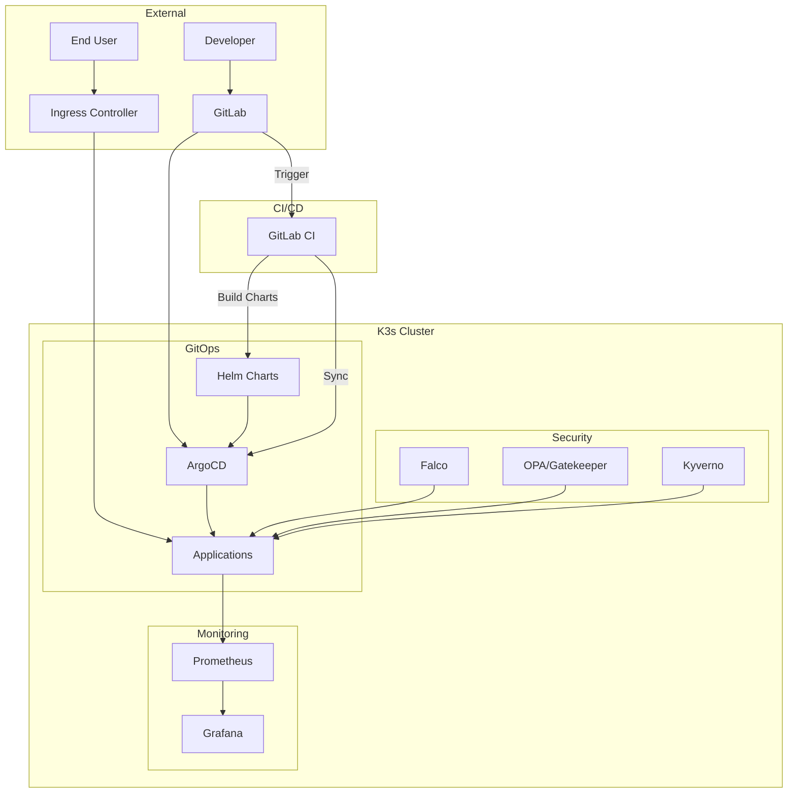
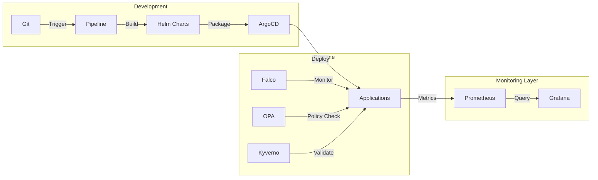
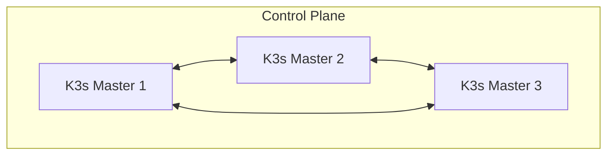

# Enterprise Kubernetes Infrastructure Project

## 🛠️ Tools & Technologies

### Core Infrastructure


### CI/CD & GitOps


### Security Tools


### Monitoring & Logging


## 🏗️ Architecture

### System Architecture


### Data Flow


### High Availability


## 📂 Project Structure

```plaintext
/devops-on-prem/
├── infrastructure/        # Core infrastructure configuration
│   ├── k3s/             # K3s cluster setup
│   ├── argocd/          # ArgoCD configuration
│   ├── ingress/         # Ingress controller setup
│   └── security/        # Security tools configuration
│       ├── falco/       # Falco runtime security
│       ├── kyverno/     # Policy management
│       └── opa/         # Open Policy Agent/Gatekeeper
├── monitoring/           # Monitoring stack
│   ├── prometheus/      # Prometheus configuration
│   └── grafana/         # Grafana dashboards
├── helm/                # Helm charts
│   ├── charts/         # Application Helm charts
│   └── values/         # Environment-specific values
└── terraform/           # IaC configurations
    ├── cluster/        # K3s cluster resources
    └── monitoring/     # Monitoring resources
```

## 🚀 Quick Start

### Prerequisites
- Linux/Unix environment
- kubectl 1.21+
- Terraform 1.0+

### 1. Infrastructure Setup
```bash
# Clone repository
git clone https://gitlab.local/devops-infrastructure.git
cd devops-on-prem

# Initialize Terraform
cd terraform
terraform init
terraform apply

# Install K3s
cd ../infrastructure/k3s
./setup.sh
```

### 2. Core Services Deployment
```bash
# Configure ArgoCD
cd ../argocd
./setup.sh

# Deploy Monitoring Stack
cd ../../monitoring
./setup.sh
```

### 3. Application Platform
```bash
# Deploy Sample Application
kubectl apply -f applicationset.yaml
```

## 🔒 Security Features

1. **Authentication & Authorization**
   - RBAC policies
   - Service accounts

2. **Secret Management**
   - Automated rotation
   - Audit logging

3. **Container Security**
   - SecurityContext
   - Network policies

## 📊 Monitoring & Logging

1. **Metrics**
   - Node metrics
   - Container metrics
   - Custom application metrics

2. **Logging**
   - Centralized logging
   - Log retention policies
   - Structured logging

3. **Alerting**
   - PrometheusRules
   - Alert routing
   - Notification channels

## 🔄 Backup & Recovery

1. **Component Backups**
   - etcd backups

2. **Disaster Recovery**
   - Terraform state recovery
   - Full cluster recovery


## 🔧 Maintenance

### Regular Tasks
1. Certificate rotation
2. Backup verification
3. Security scanning

### Monitoring
1. Resource utilization
2. Security events
3. Application health
4. Backup status

## 🚨 Troubleshooting

### Common Issues
1. Certificate expiration
2. Storage pressure
3. Network connectivity
4. Authentication failures

### Debug Commands
```bash
# Check cluster health
kubectl get nodes
kubectl get pods -A

# View logs
kubectl logs -n <namespace> <pod-name>

# Check certificates
kubectl get certificates -A
```

## 🤝 Contributing

1. Fork the repository
2. Create feature branch
3. Commit changes
4. Create merge request

## 📄 License

Copyright@2025devopshound
