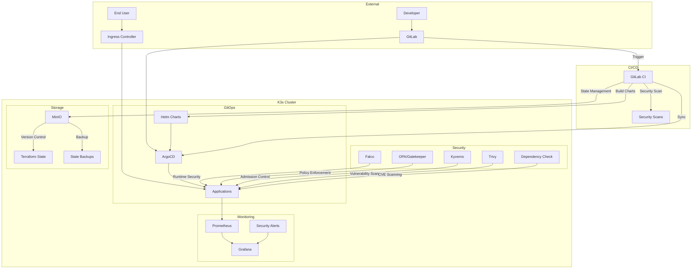
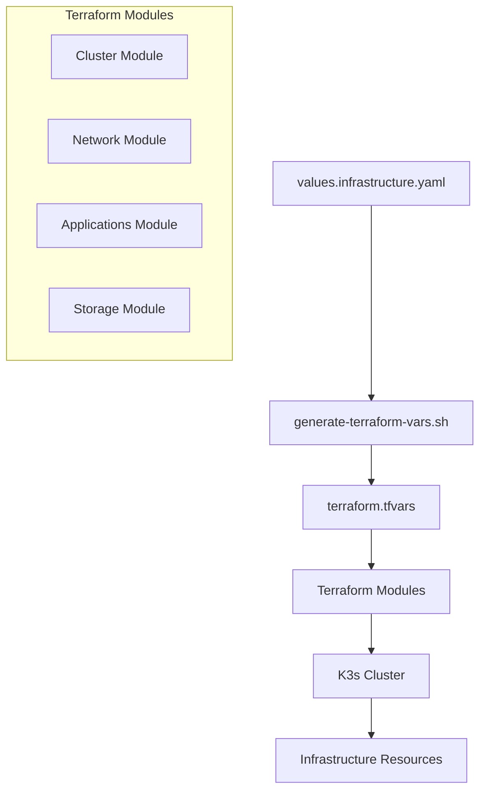

# Enterprise Kubernetes Infrastructure Project

## 🛠️ Tools & Technologies

### Core Infrastructure


### CI/CD & GitOps


### Security Tools


### Monitoring & Logging


## 🏗️ Architecture

### System Architecture


### Data Flow


### High Availability


## 🏗️ Infrastructure Management

### Resource Creation Flow


### Quick Start

1. **Configure Infrastructure**
```bash
# Copy and edit infrastructure values
cp infrastructure/values.infrastructure.yaml.example infrastructure/values.infrastructure.yaml
vim infrastructure/values.infrastructure.yaml
```

2. **Validate Configuration**
```bash
# Validate infrastructure configuration
./scripts/validate-infrastructure.sh
```

3. **Deploy Infrastructure**
```bash
# Generate and apply Terraform configuration
./scripts/deploy-infrastructure.sh
```

### Infrastructure Components

```plaintext
infrastructure/
├── values.infrastructure.yaml  # Infrastructure configuration
├── terraform/                  # Terraform modules
│   ├── modules/
│   │   ├── cluster/           # K3s cluster resources
│   │   ├── networking/        # Network configuration
│   │   ├── applications/      # Core applications
│   │   └── storage/          # Storage resources
│   └── main.tf               # Main Terraform configuration
└── scripts/
    ├── generate-terraform-vars.sh  # Configuration generator
    ├── deploy-infrastructure.sh    # Deployment script
    └── validate-infrastructure.sh  # Validation script
```

### Configuration Structure

```yaml
infrastructure:
  cluster:      # K3s cluster configuration
    name: "k3s-cluster"
    node_count: 3
    node_size: "large"
    
  networking:   # Network settings
    cidr: "10.0.0.0/16"
    subnets: ["10.0.1.0/24"]
    
  applications: # Core applications
    monitoring: {enabled: true}
    argocd: {enabled: true}
    security: {enabled: true}
    
  storage:      # Storage configuration
    minio: {enabled: true}
```

### Workflow

1. **Configuration**
   - Edit `values.infrastructure.yaml`
   - Define infrastructure requirements
   - Set component configurations

2. **Validation**
   - Syntax checking
   - Resource validation
   - Dependency verification

3. **Deployment**
   - Variable generation
   - Terraform planning
   - Infrastructure creation
   - Deployment verification

4. **Management**
   - State stored in MinIO
   - Version controlled
   - Automated backups
   - Change tracking

### Best Practices

1. **Configuration Management**
   - Version control values file
   - Use separate environments
   - Document changes
   - Regular validation

2. **Deployment**
   - Review Terraform plans
   - Test in development
   - Maintain state backups
   - Monitor resources

3. **Maintenance**
   - Regular updates
   - Security patches
   - Resource optimization
   - Performance monitoring

## 📂 Project Structure

```plaintext
/devops-on-prem/
├── infrastructure/           # Core infrastructure configuration
│   ├── k3s/                # K3s cluster setup
│   │   ├── config.yaml     # K3s configuration
│   │   └── manifests/      # K3s base manifests
│   ├── argocd/             # ArgoCD configuration
│   │   ├── values.yaml     # ArgoCD Helm values
│   │   ├── applications/   # Application definitions
│   │   └── projects/       # Project configurations
│   ├── ingress/            # Ingress controller setup
│   │   ├── values.yaml     # Ingress configuration
│   │   └── rules/         # Ingress rules
│   ├── security/           # Security tools configuration
│   │   ├── falco/         # Falco runtime security
│   │   │   ├── rules/     # Custom Falco rules
│   │   │   └── values.yaml # Falco configuration
│   │   ├── kyverno/       # Policy management
│   │   │   ├── policies/  # Default policies
│   │   │   └── custom/    # Custom policies
│   │   └── opa/           # Open Policy Agent
│   │       ├── constraints/ # OPA constraints
│   │       └── values.yaml # OPA configuration
│   └── storage/           # Storage configuration
│       └── minio/        # MinIO configuration
│           ├── values.yaml # MinIO settings
│           └── backup/    # Backup configurations
├── monitoring/            # Monitoring stack
│   ├── prometheus/       # Prometheus configuration
│   │   ├── rules/       # Alert rules
│   │   ├── values.yaml  # Prometheus settings
│   │   └── dashboards/  # Custom dashboards
│   └── grafana/         # Grafana configuration
│       ├── dashboards/  # Dashboard definitions
│       ├── alerts/      # Alert channels
│       └── values.yaml  # Grafana settings
├── terraform/            # Infrastructure as Code
│   ├── modules/         # Terraform modules
│   │   ├── cluster/    # K3s cluster module
│   │   ├── network/    # Network module
│   │   ├── apps/       # Applications module
│   │   └── storage/    # Storage module
│   ├── environments/   # Environment-specific configs
│   │   ├── dev/       # Development environment
│   │   └── prod/      # Production environment
│   ├── backend.tf     # State configuration
│   └── variables.tf   # Variable definitions
├── helm/               # Helm charts
│   ├── charts/        # Application charts
│   └── values/        # Environment values
├── scripts/           # Utility scripts
│   ├── setup/        # Installation scripts
│   │   ├── install-tools.sh
│   │   └── setup-cluster.sh
│   ├── backup/       # Backup scripts
│   │   ├── backup-etcd.sh
│   │   └── backup-state.sh
│   ├── security/     # Security scripts
│   │   ├── trivy-scan.sh
│   │   └── dependency-check.sh
│   └── monitoring/   # Monitoring scripts
├── docs/             # Documentation
│   ├── architecture/ # Architecture docs
│   ├── operations/   # Operations guides
│   └── security/     # Security docs
├── templates/        # Configuration templates
│   ├── terraform/   # Terraform templates
│   ├── kubernetes/  # K8s templates
│   └── scripts/     # Script templates
├── tests/           # Test configurations
│   ├── integration/ # Integration tests
│   └── security/    # Security tests
├── .gitlab-ci.yml   # CI/CD configuration
├── values.yaml      # Example values
├── values.local.yaml # Local values (gitignored)
└── README.md        # Project documentation
```

## 🚀 Quick Start

### Prerequisites
- Linux/Unix environment
- kubectl >={KUBECTL_MIN_VERSION}
- Terraform >={TERRAFORM_MIN_VERSION}
- yq (for YAML processing)

### 1. Configuration Setup
```bash
# Copy example values file
cp values.yaml values.local.yaml

# Edit your values
vim values.local.yaml

# Update all configuration files
./scripts/update-configs.sh
```

### 2. Infrastructure Setup
```bash
# Initialize MinIO storage
./scripts/setup-minio.sh

# Initialize Terraform with MinIO backend
cd terraform
terraform init
terraform apply

# Install K3s with generated config
cd ../infrastructure/k3s
./setup.sh
```

### 3. Core Services Deployment
```bash
# Deploy services using generated configurations
cd ../argocd
./setup.sh

cd ../../monitoring
./setup.sh
```

### 4. Application Platform
```bash
# Deploy Sample Application
kubectl apply -f applicationset.yaml  # Replace with your application configuration
```

## 📝 Configuration Management

### Central Configuration
All configuration values are managed in a single `values.yaml` file:
```yaml
infrastructure:
  k3s: {...}
  gitlab: {...}
  argocd: {...}
monitoring:
  prometheus: {...}
  grafana: {...}
security:
  falco: {...}
  opa: {...}
  trivy: {...}
  dependency-check: {...}
storage:
  minio:
    version: "RELEASE.2023-10-07T15-07-38Z"
    access_key: "xxx"
    secret_key: "xxx"
    bucket_name: "terraform-state"
    backup:
      enabled: true
      retention: "30d"
    ha:
      enabled: true
      replicas: 4
```

### Update Process
1. Never modify `values.yaml` directly
2. Create/update `values.local.yaml` with your values
3. Run `./scripts/update-configs.sh`
4. Commit template files, not actual values

### Template Structure
```plaintext
/devops-on-prem/
├── values.yaml          # Example values (committed)
├── values.local.yaml    # Your actual values (gitignored)
├── templates/          # Configuration templates
│   ├── terraform.tfvars.template
│   ├── k3s-config.yaml.template
│   └── argocd-values.yaml.template
└── scripts/
    └── update-configs.sh  # Configuration update script
```

## 🔒 Security Features

1. **Admission Control Policies**
   - Non-root container enforcement
   - Resource limits requirement
   - Privileged container prevention
   - Required labels validation
   - Latest tag prevention
   - Image registry restriction

2. **State Management**
   - Versioned state storage
   - State locking
   - Automated backups
   - Object versioning
   - Access control

3. **Authentication & Authorization**
   - RBAC policies
   - Service accounts

4. **Secret Management**
   - Automated rotation
   - Audit logging

5. **Container Security**
   - SecurityContext
   - Network policies

6. **Dependency Security**
   - OWASP Dependency-Check scanning
   - CVE vulnerability detection
   - Configurable CVSS thresholds
   - Custom suppressions support

7. **Infrastructure Security Scanning**
   - Trivy container scanning
   - Kubernetes resource scanning
   - Configuration file scanning
   - File system vulnerability scanning

### Running Security Scans
```bash
# Run dependency vulnerability scan
./scripts/dependency-check.sh

# Run Trivy security scans
./scripts/trivy-scan.sh

# View all security reports
ls -l reports/trivy/
```

### Security Scan Targets
- Container Images
- Kubernetes Resources
- Infrastructure as Code
- Configuration Files
- File System Vulnerabilities

### Security Reports
Reports are generated in multiple formats:
- Table (CLI output)
- JSON (for automation)
- HTML (for human review)

## 📊 Monitoring & Logging

1. **Metrics**
   - Node metrics
   - Container metrics
   - Custom application metrics

2. **Logging**
   - Centralized logging
   - Log retention policies
   - Structured logging

3. **Alerting**
   - PrometheusRules
   - Alert routing
   - Notification channels

## 🔄 Backup & Recovery

1. **Component Backups**
   - etcd backups

2. **Disaster Recovery**
   - Terraform state recovery
   - Full cluster recovery

## 🔧 Maintenance

### Regular Tasks
1. Certificate rotation
2. Backup verification
3. Security scanning

### Monitoring
1. Resource utilization
2. Security events
3. Application health
4. Backup status

## 🚨 Troubleshooting

### Common Issues
1. Certificate expiration
2. Storage pressure
3. Network connectivity
4. Authentication failures

### Debug Commands
```bash
# Check cluster health
kubectl get nodes
kubectl get pods -A

# View logs
kubectl logs -n <namespace> <pod-name>

# Check certificates
kubectl get certificates -A
```

## 🤝 Contributing

1. Fork the repository
2. Create feature branch
3. Commit changes
4. Create merge request


## 🔧 Parameters to Replace

The following parameters need to be replaced with actual values:

### Infrastructure Parameters
- `{GITLAB_INSTANCE_URL}`: Your GitLab instance URL (e.g., gitlab.company.com)
- `{NODE_IP}`: K3s node IP address
- `{K3S_TOKEN}`: K3s cluster token
- `{KUBECTL_MIN_VERSION}`: Minimum required kubectl version
- `{TERRAFORM_MIN_VERSION}`: Minimum required Terraform version

### Application Parameters
- `{ARGOCD_ADMIN_PASSWORD}`: Initial ArgoCD admin password
- `{ARGOCD_DOMAIN}`: ArgoCD ingress domain

### Configuration Files
The following files may need environment-specific values:
- `terraform/environment.tfvars`
- `helm/values/*.yaml`
- `infrastructure/*/config.yaml`
