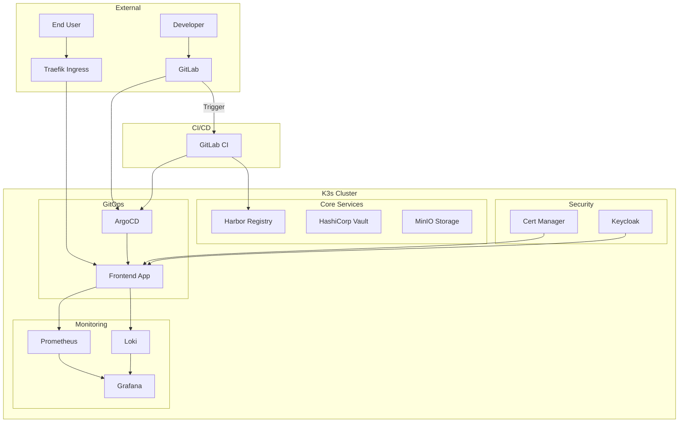
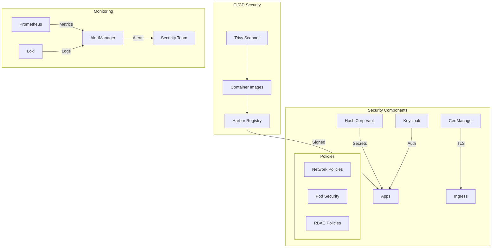
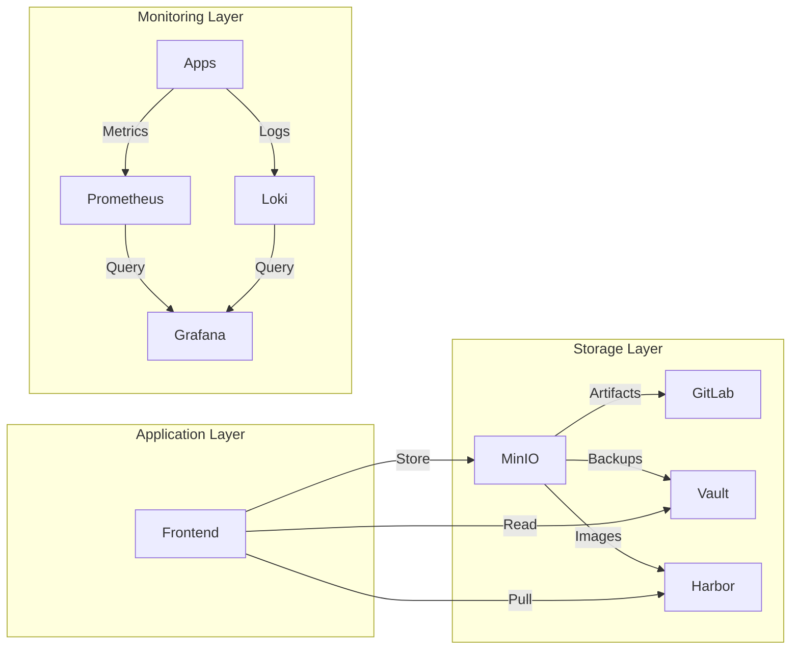
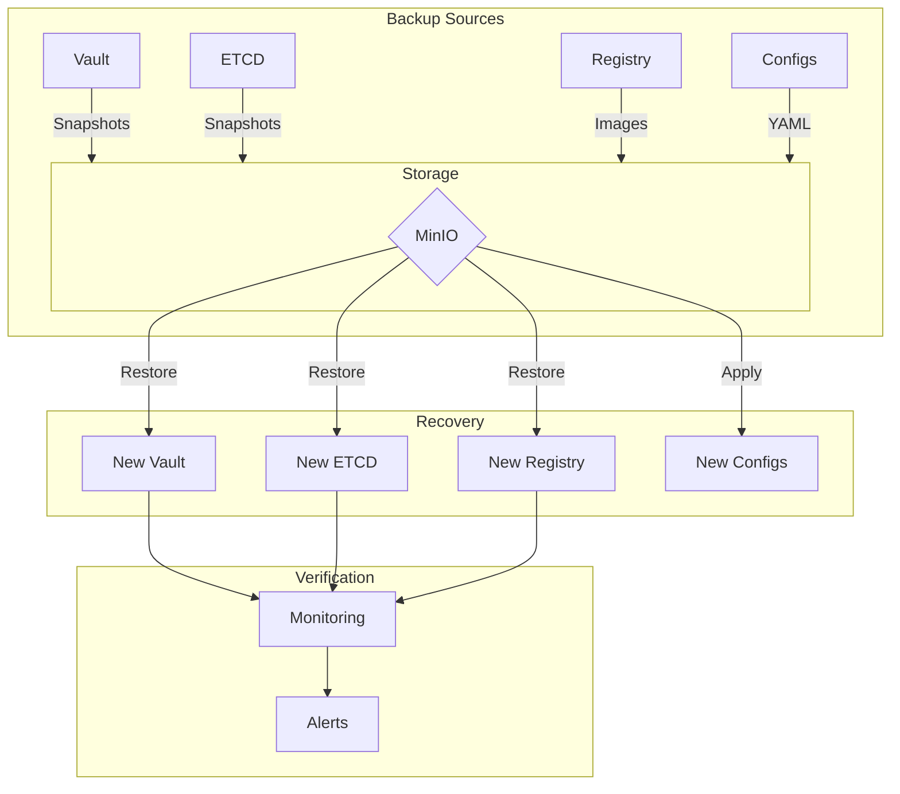
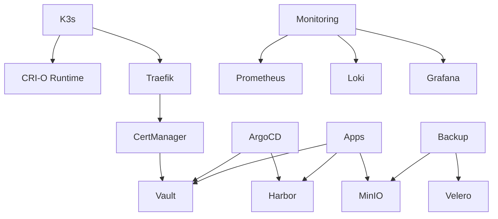
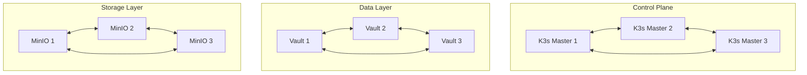
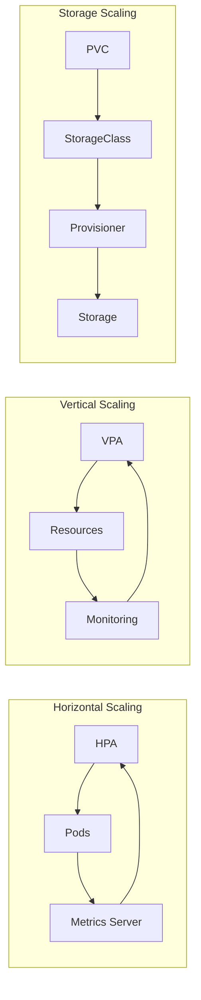

# Architecture Documentation

## High-Level Architecture


## Networking Architecture
```mermaid
graph LR
    subgraph External Network
        Internet
        DNS[DNS Server]
    end
    
    subgraph K3s Network
        Ingress[Traefik] --> |TLS| App[Applications]
        App --> |Metrics| Monitoring
        App --> |Logs| Logging
        
        subgraph Service Mesh
            Ingress --> |443| Frontend
            Frontend --> |8200| Vault
            Frontend --> |5000| Registry
            Frontend --> |9000| Storage
        end
    end
    
    Internet --> |443| Ingress
    DNS --> |53| K3s Network
```

## Security Architecture


## Data Flow Architecture


## Backup & Recovery Architecture


## Component Dependencies


## High Availability Design


## Scaling Architecture

