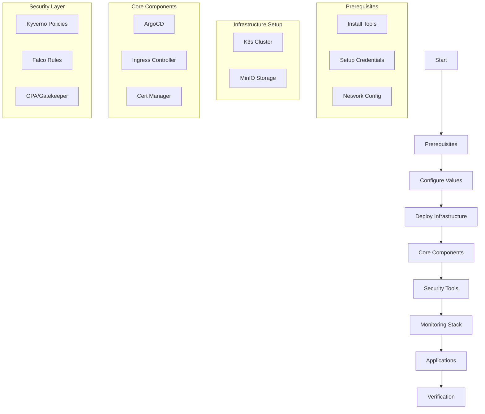
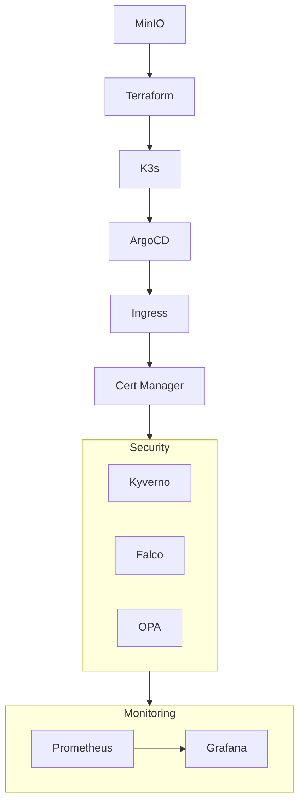

# Deployment Guide

## Deployment Flow


## Deployment Steps

### 1. Prerequisites Setup
```bash
# Install required tools
./scripts/setup/install-tools.sh

# Verify installations
kubectl version
terraform version
helm version
```

Required Tools:
- kubectl (>= 1.21)
- terraform (>= 1.0)
- helm (>= 3.8)
- yq
- git
- docker

### 2. Configuration Setup
1. Copy and edit main values:
   ```bash
   cp values.yaml values.local.yaml
   vim values.local.yaml
   ```

2. Configure credentials:
   ```yaml
   infrastructure:
     gitlab:
       token: "your-gitlab-token"
     argocd:
       admin_password: "secure-password"
   ```

3. Set network configuration:
   ```yaml
   networking:
     domain: "your-domain.com"
     cidr: "10.0.0.0/16"
   ```

### 3. Infrastructure Deployment
1. Initialize MinIO storage:
   ```bash
   ./scripts/setup-minio.sh
   ```

2. Deploy K3s cluster:
   ```bash
   cd infrastructure/k3s
   ./scripts/install-k3s.sh --ha
   ```

3. Verify cluster:
   ```bash
   kubectl get nodes
   kubectl get pods -A
   ```

### 4. Core Components
1. Deploy ArgoCD:
   ```bash
   cd infrastructure/argocd
   ./setup.sh
   ```

2. Configure ingress:
   ```bash
   helm upgrade -i ingress ./helm/charts/ingress
   ```

3. Setup cert-manager:
   ```bash
   kubectl apply -f infrastructure/cert-manager/
   ```

### 5. Security Implementation
1. Deploy Kyverno:
   ```bash
   ./scripts/setup-kyverno.sh
   ```

2. Apply security policies:
   ```bash
   kubectl apply -f infrastructure/security/kyverno/policies/
   ```

3. Setup Falco:
   ```bash
   helm upgrade -i falco ./helm/charts/falco
   ```

### 6. Monitoring Setup
1. Deploy Prometheus:
   ```bash
   helm upgrade -i prometheus ./helm/charts/prometheus
   ```

2. Configure Grafana:
   ```bash
   helm upgrade -i grafana ./helm/charts/grafana
   ```

3. Import dashboards:
   ```bash
   kubectl apply -f monitoring/grafana/dashboards/
   ```

### 7. Verification Steps
1. Check core services:
   ```bash
   kubectl get pods -n argocd
   kubectl get pods -n monitoring
   kubectl get pods -n security
   ```

2. Verify security policies:
   ```bash
   kubectl get policyreport -A
   ```

3. Access UIs:
   - ArgoCD: https://argocd.your-domain.com
   - Grafana: https://grafana.your-domain.com
   - Prometheus: https://prometheus.your-domain.com

## Component Dependencies


## Configuration Checklist
- [ ] values.local.yaml configured
- [ ] Network settings verified
- [ ] SSL certificates available
- [ ] Storage provisioned
- [ ] Security policies reviewed
- [ ] Monitoring alerts configured
- [ ] Backup settings verified

## Troubleshooting
1. Check component status:
   ```bash
   ./scripts/verify-deployment.sh
   ```

2. View logs:
   ```bash
   kubectl logs -n <namespace> <pod-name>
   ```

3. Verify configurations:
   ```bash
   ./scripts/validate-configs.sh
   ```
